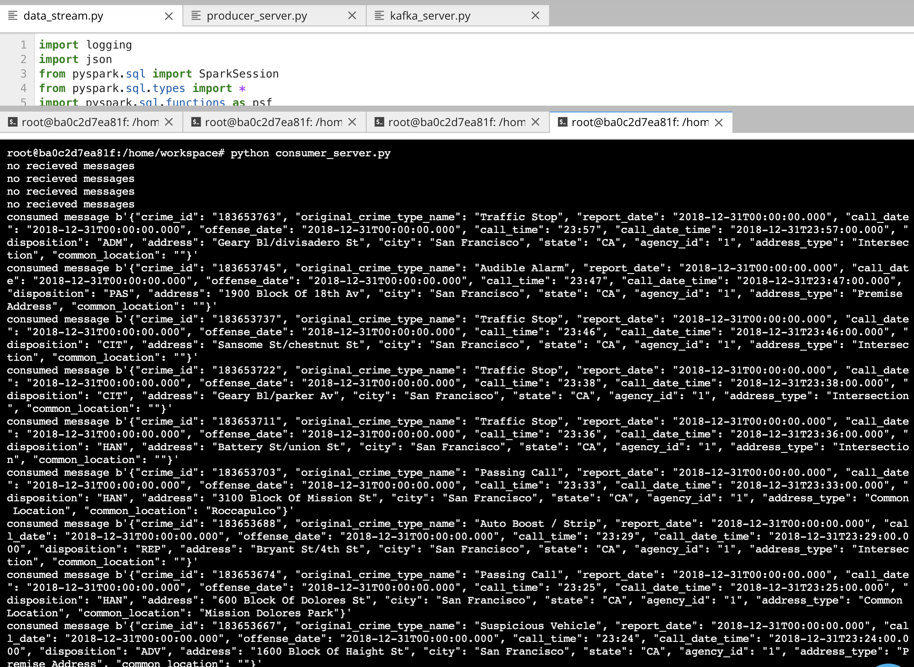
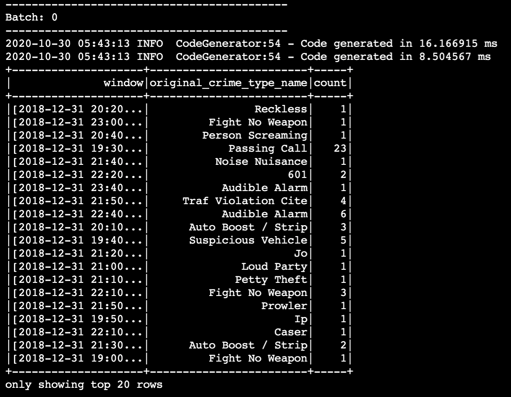
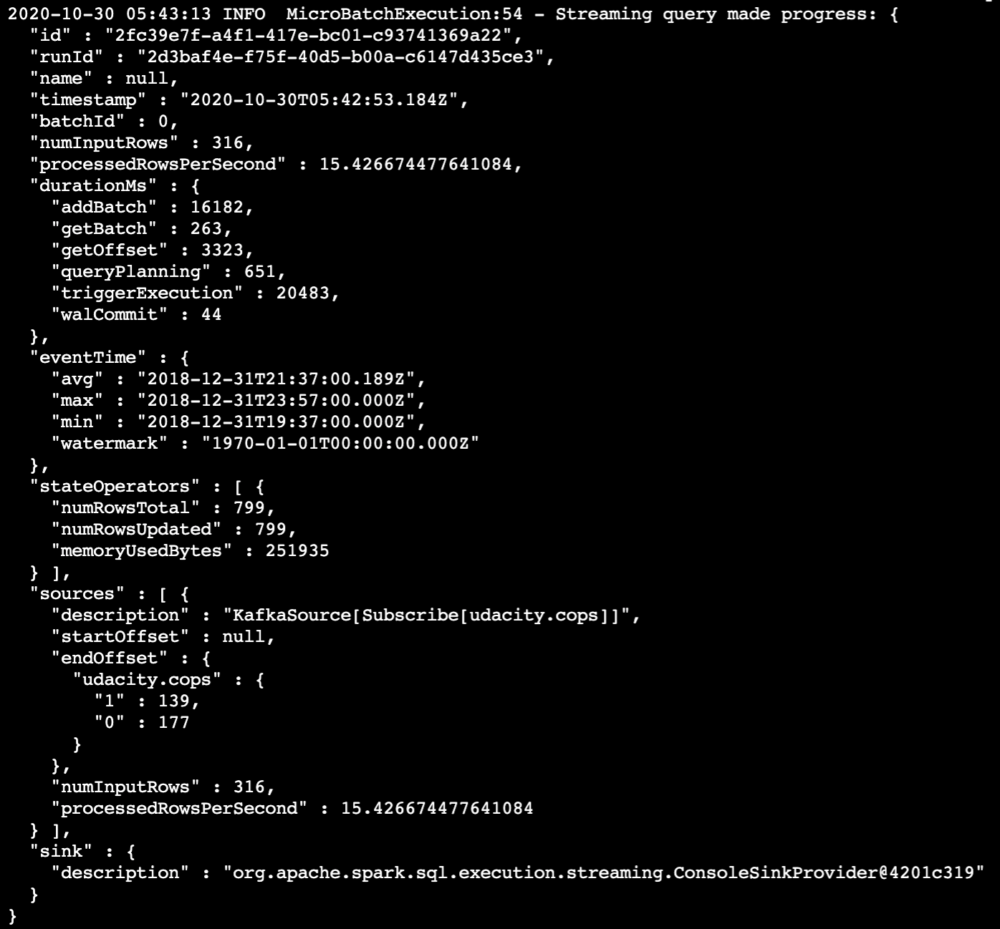
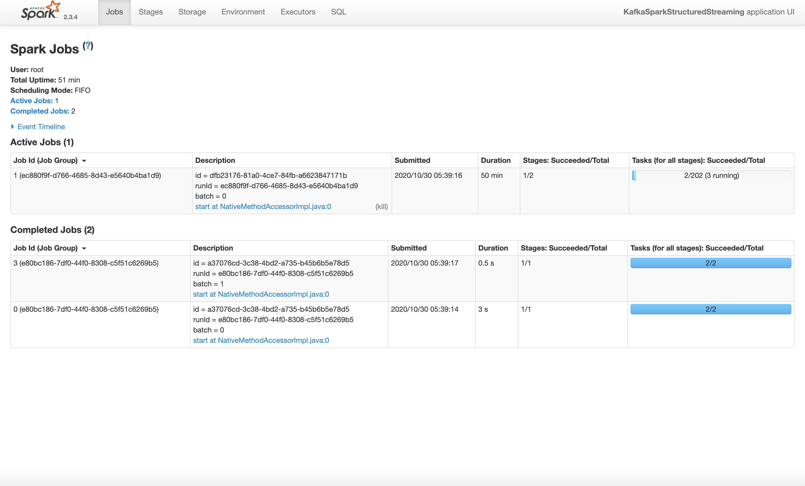

# SF Crime Data Streaming with Spark  
The motivation for this project was to integrate Kafka and Spark to stream SF crime data.
    

## Requirements  
* Spark 2.4.3
* Scala 2.11.x
* Java 1.8.x
* Kafka build with Scala 2.11.x
* Python 3.6.x or 3.7.x

## Questions  
1. How did changing values on the SparkSession property parameters affect the throughput and latency of the data?
- The two properties that affected throughhput and latency was **maxRatePerPartition** and **maxOffsetPerTrigger**.

2. What were the 2-3 most efficient SparkSession property key/value pairs? Through testing multiple variations on values, how can you tell these were the most optimal?
The two spark key that affected that were used to see efficiency were **numInputRows** and **processedRowsPerSecond**. Experimenting with **maxRatePerPartition** and **maxOffsetPerTrigger** at 100 for both properties
up to 100 it increases throughput and reduces latency. After 200, especially **maxOffsetPerTrigger** did not create more efficiency or reduce latency. The optimal key/value pair were
* **maxRatePerPartition**: 200
* **maxOffsetPerTrigger**: 200

##Consumer Console:  

##Spark Output Table and Progress Report
<

<

##Spark UI
<

